# 手把手教你使用Vue写一个微信读书APP!

## 第一章 项目介绍

> 用Vue实现  高仿 微信读书(PC端/手机端 通用)

#### 技术栈

- [Vue.js](https://cn.vuejs.org/)
- [Vue Router](https://router.vuejs.org/)
- [Vue CLI](https://cli.vuejs.org/)
- [Vuex](https://vuex.vuejs.org/zh/)
- [Element](https://element.eleme.io/)

#### 案例演示

> 暂无 

#### 预备知识

- HTML
- CSS
- JavaScript
- Vue.js 基础

#### 相关资源

源代码: https://github.com/czh789dv/czh-reader

电子书和图标文件: https://github.com/czh789dv/czh-reader


## 第二章 项目起步

### 2.1 建立项目

1. 首先你必须在电脑中安装好Vue Cli脚手架工具 和NodeJS

2. 打开cmd 输入

   ```cmd
   vue init webpack czh-reader //czh-reader是本项目名称
   ```

3. 进入项目目录 输入

   ```cmd
   npm run dev
   ```

   **如果可以访问:[http://localhost:8080**](http://localhost:8080/)

   项目就建立成功了!

   

### 2.2 **事先准备**

1. 下载电子书放在项目目录 czh-reader\static\下

2. 下载图标字体文件放在项目目录 czh-reader\src\assets\styles\下

3. 在main.js中引入图标CSS

   ```JS
   import '@/assets/styles/icon.css'
   ```

4. 安装依赖包

   ```cmd
   npm install node-sass sass-loader --save  //安装sass依赖包
   npm install epubjs --save //安装epub电子书依赖包
   ```

5. 视口设置  

   在index.html修改视口设置 让手机端用户无法缩放界面

   ```html
   <meta name="viewport" content="width=device-width,initial-scale=1.0,maximum-scale=1.0,minimum-scale=1.0,user-scalable=no">
   ```

6. Rem配置

   rem可以根据屏幕大小动态的改变字体大小

   修改App.vue  先删除掉style里所有的默认样式

   ```js
   document.addEventListener('DOMContentLoaded', () => {
     const html = document.querySelector('html')
     let fontSize = window.innerWidth / 15   
     fontSize = fontSize > 50 ? 50 : fontSize
     html.style.fontSize = fontSize + 'px'
   })
   ```

   添加一个事件监听器 来改变fontSize   

   这里把fontSize设为屏幕最大款度的15分之一

   然后字体最大设置为50

   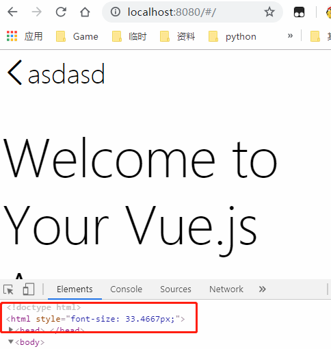

7. reset.sass和global.sass 设置

   **reset.sass 重置所有的样式**

   访问https://meyerweb.com/eric/tools/css/reset/

   在czh-reader\src\assets\styles\ 新建reset.sass 并将网页上的重置样式复制进去

   同时在结尾添加字体html和body的样式

   ```css
   html, body {
       width: 100%;
       height: 100%;
       font-family: 'Courier New', Courier, monospace;
   }
   ```

   **global.sass 设置全局样式**

   在czh-reader\src\assets\styles\ 新建global.sass 

   ```scss
   @import 'reset';
   
   $fontSize: 37.5;
   @function px2rem($px) {
       @return ($px / $fontSize) +rem;
   }
   
   @mixin center() {
           display: flex;
           justify-content: center;
           align-items: center
       }
   ```

```
   
**在Vue中导入样式**
   
打开main.js
   
   ```js
   import '@/assets/styles/global.scss'
```

刷新一下页面  样式就全部改变了

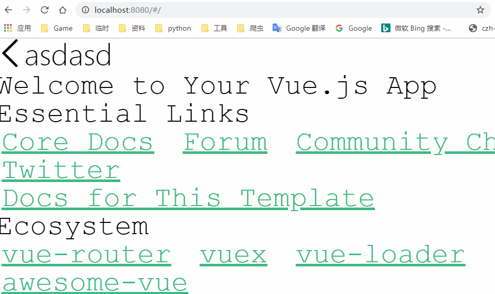

   


准备工作这样就全部做好了


## 第三章 项目具体功能实现

### 3.1 EPUB基本介绍

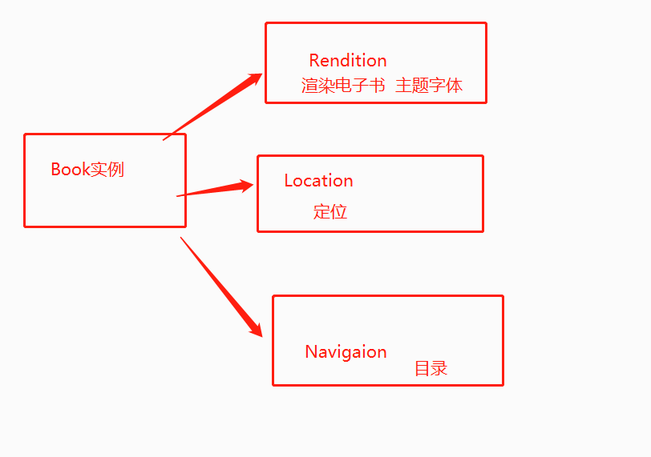

### 3.2 电子书解析和渲染

首先新建一个Book.vue文件 

具体的功能实现详看备注

```js
<template>
<div class="book">
    <div class="read-wrapper">
        <div id="read"></div>
    </div>
</div>
</template>

<script>
//导入epubjs库
import Epub from 'epubjs'
//传递一个书的路径 后期会放在服务器
const DOWNLOAD_URL = '/static/三体.epub'

export default {
    methods: {
        //渲染电子书
        showEpub() {
            //生成BOOK实例对象
            this.book = new Epub(DOWNLOAD_URL)
            console.log(this.book)
            //生成rendition
            this.rendition = this.book.renderTo('read', {
                //让书的宽高和屏幕一样
                width: window.innerWidth,
                height: window.innerHeight
            })
            //通过rendition.display渲染电子书
            this.rendition.display()
        }
    },
    mounted() {
        //生命周期钩子函数 
        this.showEpub ()
    },

}
</script>

<style lang="scss" scoped>
@import 'assets/styles/global.scss'
</style>

```

然后在router/index.js中修改如下

```js
routes: [
    {
      path: '/',
      redirect: '/book'
    },
    {
      path: '/book',
      name: 'Book',
      component: Book
    }
  ]
```

现在 打开网页 就可以看到电子书了

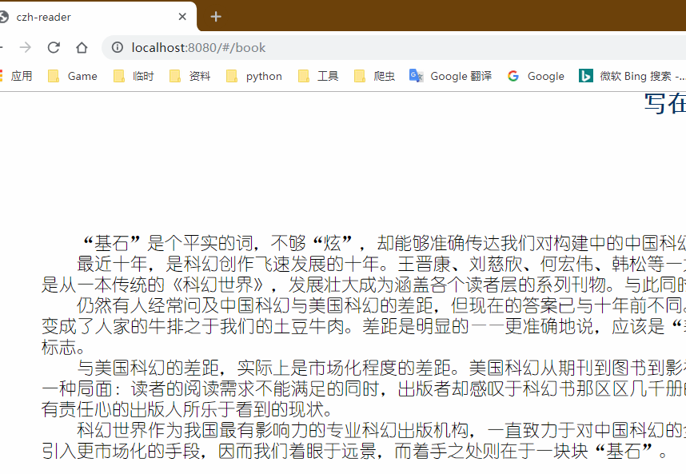

### 3.3 翻页功能

实现翻页功能 我们首先要给这个页面建立一个相对定位的浮层

修改Book.vue 的HTML部分

```html
<div class="book">
    <div class="read-wrapper">
        <div id="read"></div>
        <div class="mask">
            <div class="left" @click="prevPage()"></div>
            <div class="center"></div>
            <div class="right" @click="nextPage()"></div>
        </div>
    </div>
</div>
```

修改Book.vue 的CSS部分

```css
@import 'assets/styles/global.scss';
.book{
    position: relative;
    .read-wrapper{
        .mask{
            position: absolute;
            top:0;
            left: 0;
            z-index: 100;
            width: 100%;
            height: 100%;
            display: flex;
            // background-color: yellowgreen;
            .left{
                flex: 0 0 px2rem(150);   
            }
            .right{
                flex: 0 0 px2rem(150);
            }
            .center{
                flex: 1;
            }}}}
```

这里分别在左中右加入背景色我们先看一下效果

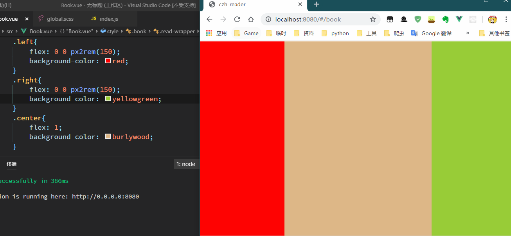

浮层OK  接下来给浮层添加点击事件

```js
        //上一页
        prevPage(){
            //调用Rendition.prev方法
            if (this.rendition) {
                this.rendition.prev()
            }
        },
        //下一页
        nextPage(){
             //调用Rendition.next方法
            if (this.rendition) {
                this.rendition.next()
            }
        },
```

再刷新一下 点击 左右2边就可以实现翻页了

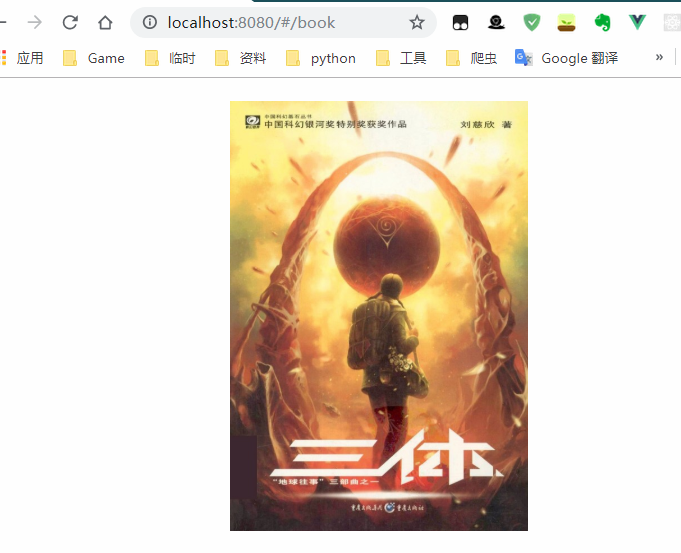


### 3.4  标题栏菜单栏 布局和样式

首先我们先在HTML部分加入标题栏的布局

```html
<div class="book">
    <div class="title-wrapper">
        <div class="left">
            <span class="icon-back icon"></span>
        </div>
        <div class="right">
            <div class="icon-wrapper">
                <span class="icon-cart icon">买</span>
            </div>
            <div class="icon-wrapper">
                <span class="icon-person icon"></span>
            </div>
            <div class="icon-wrapper">
                <span class="icon-more icon"></span>
            </div>
        </div>
    </div>

    <div class="read-wrapper">
```

给了左边 右边 2个区域  左边 放置返回/退出键  右边放置购物车 个人中心 和其他设置

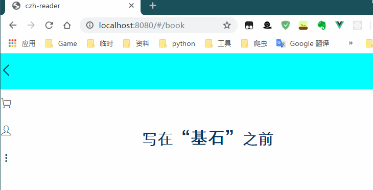

接下来 写标题栏的样式

```css
.title-wrapper {
        position: absolute;
        top: 0;
        left: 0;
        z-index: 101;
        width: 100%;
        height: px2rem(48);
        background: white;
        display: flex;
        box-shadow: 0 px2rem(5) px2rem(5) rgba(0, 0, 0, 0.15);

        .left {
            flex: 0 0 px2rem(50);
            @include center; }

        .right {
            display: flex;
            flex: 1;
            justify-content: flex-end;

            .icon-wrapper {
                flex: 0 0 px2rem(40);
                @include center;

                .icon-cart {
                    font-size: px2rem(22);
                } }} }
```

首先 他是一个相对定位 漂浮在最上层 Z-index比翻页功能要高

然后弹性布局,高度设置为48像素 加了一个向下5像素的15%透明度的黑色阴影

引入之前写好的全局居中

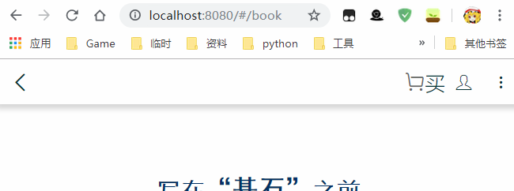

标题栏 的样式就这样写好了 

菜单栏基本一样 

HTML部分

```html
<div class="menu-wrapper">
        <div class="icon-wrapper">
            <span class="icon-menu icon"></span>
        </div>
        <div class="icon-wrapper">
            <span class="icon-progress icon"></span>
        </div>
        <div class="icon-wrapper">
            <span class="icon-bright icon"></span>
        </div>
        <div class="icon-wrapper">
            <span class="icon-a icon">A</span>
        </div>
    </div>
```

CSS部分

```css
.menu-wrapper{
        position: absolute;
        bottom: 0;
        left: 0;
        z-index: 101;
        width: 100%;
        height: px2rem(48);
        background: white;
        display: flex;
        box-shadow: 0 px2rem(-5) px2rem(5) rgba(0, 0, 0, 0.15);
        .icon-wrapper{
            flex: 1;
            @include center;
            .icon-progress{
                font-size: px2rem(24);
            }
            .icon-bright{
                font-size: px2rem(24);
            }
        }
    }
```

基本上没有什么变化 ,就是将top0改成了buttom0 阴影部分为-5个像素

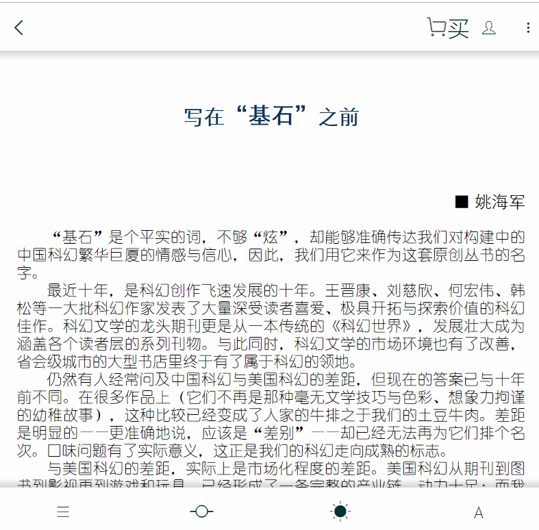


### 3.5 标题栏菜单栏事件

首先 我们需要给标题栏菜单栏绑定一个隐藏事件,默认是隐藏的,点击中间区域 可以切换隐藏

```html
<div class="title-wrapper" v-show="ifTitleAndMenuShow">
    </div>
    <div class="read-wrapper">
    </div>
    <div class="menu-wrapper" v-show="ifTitleAndMenuShow">
    </div>
```

然后添加一个data   ,默认返回值false

```js
export default {
    data() {
        return {
            ifTitleAndMenuShow: false
        }
    },
```

接下来在mask的center绑定一个方法

```html
<div class="mask">
            <div class="left" @click="prevPage()"></div>
            <div class="center" @click="toggleTitleAndMenu"></div>
            <div class="right" @click="nextPage()"></div>
        </div>
```

定义这个方法 ,直接取反即可

```js
 methods: {
        toggleTitleAndMenu() {
            this.ifTitleAndMenuShow = !this.ifTitleAndMenuShow
        },
```

好了 我们来点击一下试试效果

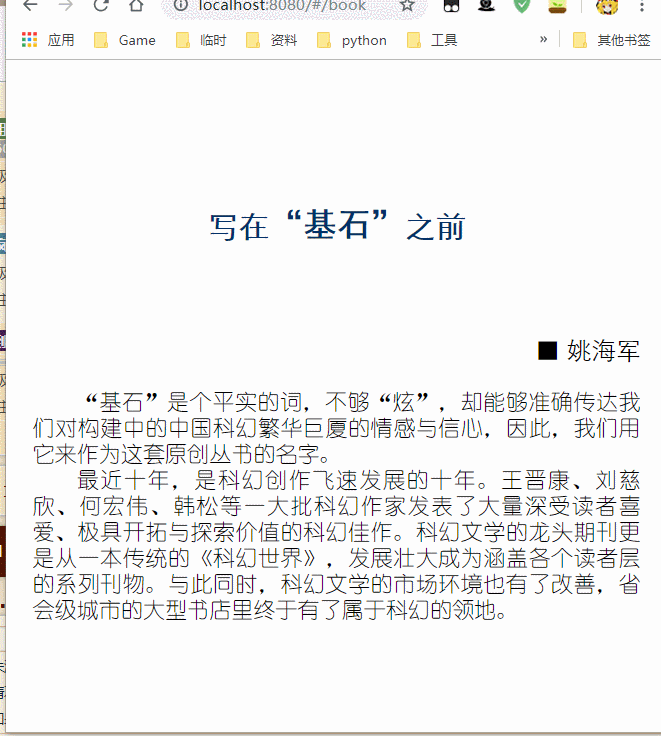

这里有点突兀.所以我们需要添加一下过渡动画

以下是VUE官方给出的过渡动画说明

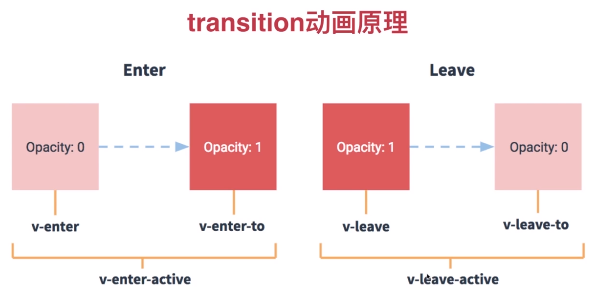

进入和离开都有3个阶段 Vue能够自动给你的标签添加class来执行 我们只需要写好样式即可

首先使用一个tranition标签 包裹住标题

```html
<transition name="slide-down">
    <div class="title-wrapper" v-show="ifTitleAndMenuShow">
    </div></transition>
```

接下来写样式

```css
.title-wrapper {
        
        &.slide-down-enter{
            transform: translate3d(0,-100%,0)
        }
        &.slide-down-enter-to{
            transform: translate3d(0,0,0)
        }
        &.slide-down-enter-active{
            transition: all .5s linear;
        }
        &.slide-down-leave{
            transform: translate3d(0,0,0)
        }
        &.slide-down-leave-to{
            transform: translate3d(0,-100%,0)
        }
        &.slide-down-leave-active{
            transition: all .5s linear;
        }
    }
```

enter和leave其中2条一样的 可以简写到一条里面去 

加&符把动画和title-wrapper设置为同级的

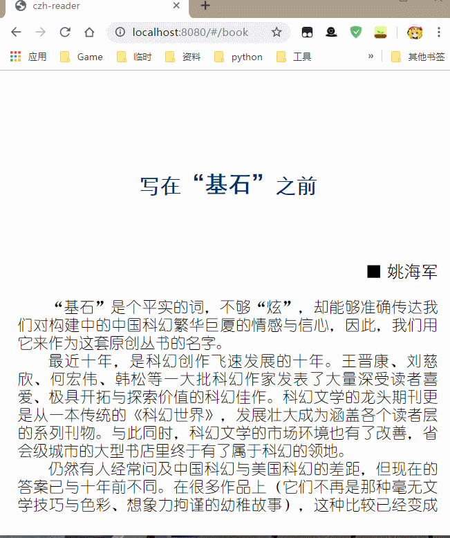

接下来 写下面的菜单栏

```html
<transition name="slide-up">
    <div class="menu-wrapper" v-show="ifTitleAndMenuShow">
    </div></transition>
```

样式和前面基本一致

```css
    .menu-wrapper {

        &.slide-up-enter,
        &.slide-up-leave-to {
            transform: translate3d(0, 100%, 0)
        }

        &.slide-up-enter-to,
        &.slide-up-leave {
            transform: translate3d(0, 0, 0)
        }

        &.slide-up-enter-active,
        &.slide-up-leave-active {
            transition: all .5s linear;
        }

    }
```

看一下效果

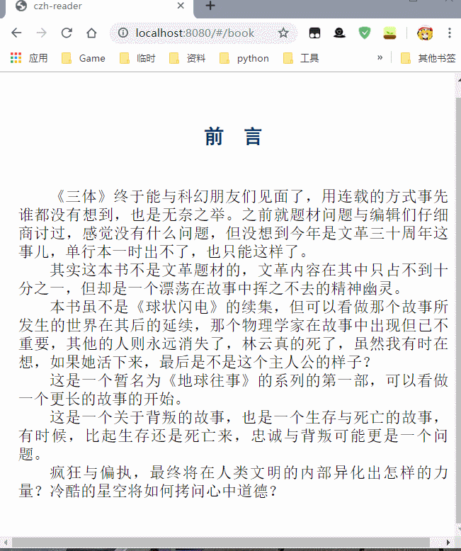

优化---

因为动画里 还是有很多重复的代码 我们可以把他们重新优化一下

删除所有动画代码 复制到global.scss里

```scss
.slide-up-enter,
.slide-up-leave-to {
    transform: translate3d(0, 100%, 0)
}

.slide-down-enter,
.slide-down-leave-to {
    transform: translate3d(0, -100%, 0)
}

.slide-down-enter-to,
.slide-down-leave,
.slide-up-enter-to,
.slide-up-leave{
    transform: translate3d(0, 0, 0)
}

.slide-down-enter-active,
.slide-down-leave-active,
.slide-up-enter-active,
.slide-up-leave-active{
    transition: all .5s linear;
}
```

合并之后 只剩这些  

同时 之后的代码如果需要使用这个动画 可以直接添加slide-up/slide-down 就可以使用了


### 3.6 字体更改


### 3.7 主题设置

### 3.8 阅读进度

### 3.9 目录功能


## 第四章 项目发布

### 4.1webpack打包

### 4.2 相关文件上传服务器

### 4.3 腾讯云/阿里云 布置

### 4.4 ios发布

### 4.5 安卓发布


## 第五章 技术总结


## 赞助 支持
