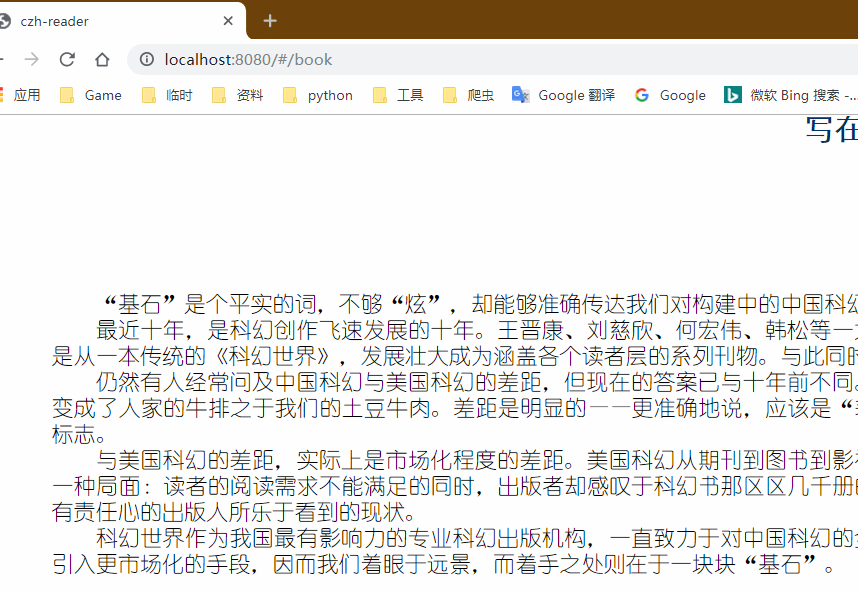
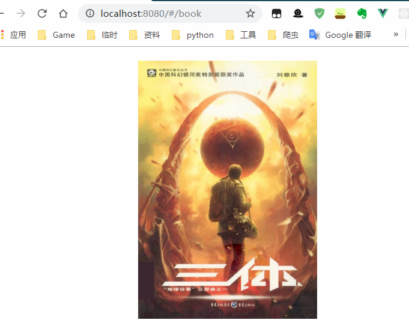
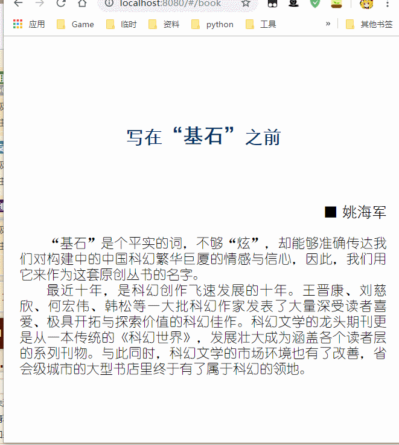
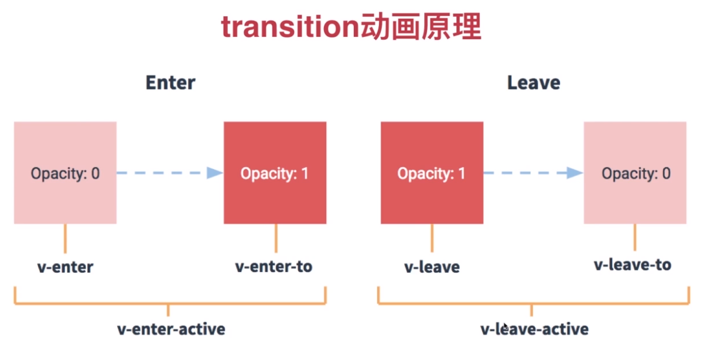

# 手把手教你使用Vue写一个微信读书APP!

## 第一章 项目介绍

> 用Vue实现  高仿 微信读书(PC端/手机端 通用)

#### 技术栈

- [Vue.js](https://cn.vuejs.org/)
- [Vue Router](https://router.vuejs.org/)
- [Vue CLI](https://cli.vuejs.org/)
- [Vuex](https://vuex.vuejs.org/zh/)
- [Element](https://element.eleme.io/)

#### 案例演示

> 暂无 

#### 预备知识

- HTML
- CSS
- JavaScript
- Vue.js 基础

#### 相关资源

源代码: https://github.com/czh789dv/czh-reader

电子书和图标文件: https://github.com/czh789dv/czh-reader


## 第二章 项目起步

### 2.1 建立项目

1. 首先你必须在电脑中安装好Vue Cli脚手架工具 和NodeJS

2. 打开cmd 输入

   ```cmd
   vue init webpack czh-reader //czh-reader是本项目名称
   ```

3.  进入项目目录 输入

   ```cmd
   npm run dev
   ```

   **如果可以访问:[http://localhost:8080**](http://localhost:8080/)

   项目就建立成功了!

   

### 2.2 **事先准备**

1. 下载电子书放在项目目录 czh-reader\static\下

2. 下载图标字体文件放在项目目录 czh-reader\src\assets\styles\下

3. 在main.js中引入图标CSS

   ```JS
   import '@/assets/styles/icon.css'
   ```

 4. 安装依赖包

    ```cmd
    npm install node-sass sass-loader --save  //安装sass依赖包
    npm install epubjs --save //安装epub电子书依赖包
    ```

5. 视口设置  

   在index.html修改视口设置 让手机端用户无法缩放界面

   ```html
   <meta name="viewport" content="width=device-width,initial-scale=1.0,maximum-scale=1.0,minimum-scale=1.0,user-scalable=no">
   ```

6. Rem配置

   rem可以根据屏幕大小动态的改变字体大小

   修改App.vue  先删除掉style里所有的默认样式

   ```js
   document.addEventListener('DOMContentLoaded', () => {
     const html = document.querySelector('html')
     let fontSize = window.innerWidth / 15   
     fontSize = fontSize > 50 ? 50 : fontSize
     html.style.fontSize = fontSize + 'px'
   })
   ```

   添加一个事件监听器 来改变fontSize   

   这里把fontSize设为屏幕最大款度的15分之一

   然后字体最大设置为50

   

7. reset.sass和global.sass 设置

   **reset.sass 重置所有的样式**

   访问https://meyerweb.com/eric/tools/css/reset/

   在czh-reader\src\assets\styles\ 新建reset.sass 并将网页上的重置样式复制进去

   同时在结尾添加字体html和body的样式

   ```css
   html, body {
       width: 100%;
       height: 100%;
       font-family: 'Courier New', Courier, monospace;
   }
   ```

   **global.sass 设置全局样式**

   在czh-reader\src\assets\styles\ 新建global.sass 

   ```scss
   @import 'reset';
   
   $fontSize: 37.5;
   @function px2rem($px) {
       @return ($px / $fontSize) +rem;
   }
   
   @mixin center() {
           display: flex;
           justify-content: center;
           align-items: center
       }
   ```
```
   
**在Vue中导入样式**
   
打开main.js
   
   ```js
   import '@/assets/styles/global.scss'
```

刷新一下页面  样式就全部改变了


   


准备工作这样就全部做好了


## 第三章 项目具体功能实现

### 3.1 EPUB基本介绍


### 3.2 电子书解析和渲染

首先新建一个Book.vue文件 

具体的功能实现详看备注

```js
<template>
<div class="book">
    <div class="read-wrapper">
        <div id="read"></div>
    </div>
</div>
</template>

<script>
//导入epubjs库
import Epub from 'epubjs'
//传递一个书的路径 后期会放在服务器
const DOWNLOAD_URL = '/static/三体.epub'

export default {
    methods: {
        //渲染电子书
        showEpub() {
            //生成BOOK实例对象
            this.book = new Epub(DOWNLOAD_URL)
            console.log(this.book)
            //生成rendition
            this.rendition = this.book.renderTo('read', {
                //让书的宽高和屏幕一样
                width: window.innerWidth,
                height: window.innerHeight
            })
            //通过rendition.display渲染电子书
            this.rendition.display()
        }
    },
    mounted() {
        //生命周期钩子函数 
        this.showEpub ()
    },

}
</script>

<style lang="scss" scoped>
@import 'assets/styles/global.scss'
</style>

```

然后在router/index.js中修改如下

```js
routes: [
    {
      path: '/',
      redirect: '/book'
    },
    {
      path: '/book',
      name: 'Book',
      component: Book
    }
  ]
```

现在 打开网页 就可以看到电子书了



### 3.3 翻页功能

实现翻页功能 我们首先要给这个页面建立一个相对定位的浮层

修改Book.vue 的HTML部分

```html
<div class="book">
    <div class="read-wrapper">
        <div id="read"></div>
        <div class="mask">
            <div class="left" @click="prevPage()"></div>
            <div class="center"></div>
            <div class="right" @click="nextPage()"></div>
        </div>
    </div>
</div>
```

修改Book.vue 的CSS部分

```css
@import 'assets/styles/global.scss';
.book{
    position: relative;
    .read-wrapper{
        .mask{
            position: absolute;
            top:0;
            left: 0;
            z-index: 100;
            width: 100%;
            height: 100%;
            display: flex;
            // background-color: yellowgreen;
            .left{
                flex: 0 0 px2rem(150);   
            }
            .right{
                flex: 0 0 px2rem(150);
            }
            .center{
                flex: 1;
            }}}}
```

这里分别在左中右加入背景色我们先看一下效果


浮层OK  接下来给浮层添加点击事件

```js
        //上一页
        prevPage(){
            //调用Rendition.prev方法
            if (this.rendition) {
                this.rendition.prev()
            }
        },
        //下一页
        nextPage(){
             //调用Rendition.next方法
            if (this.rendition) {
                this.rendition.next()
            }
        },
```

再刷新一下 点击 左右2边就可以实现翻页了




### 3.4  标题栏菜单栏 布局和样式

首先我们先在HTML部分加入标题栏的布局

```html
<div class="book">
    <div class="title-wrapper">
        <div class="left">
            <span class="icon-back icon"></span>
        </div>
        <div class="right">
            <div class="icon-wrapper">
                <span class="icon-cart icon">买</span>
            </div>
            <div class="icon-wrapper">
                <span class="icon-person icon"></span>
            </div>
            <div class="icon-wrapper">
                <span class="icon-more icon"></span>
            </div>
        </div>
    </div>

    <div class="read-wrapper">
```

给了左边 右边 2个区域  左边 放置返回/退出键  右边放置购物车 个人中心 和其他设置


接下来 写标题栏的样式

```css
.title-wrapper {
        position: absolute;
        top: 0;
        left: 0;
        z-index: 101;
        width: 100%;
        height: px2rem(48);
        background: white;
        display: flex;
        box-shadow: 0 px2rem(5) px2rem(5) rgba(0, 0, 0, 0.15);

        .left {
            flex: 0 0 px2rem(50);
            @include center; }

        .right {
            display: flex;
            flex: 1;
            justify-content: flex-end;

            .icon-wrapper {
                flex: 0 0 px2rem(40);
                @include center;

                .icon-cart {
                    font-size: px2rem(22);
                } }} }
```

首先 他是一个相对定位 漂浮在最上层 Z-index比翻页功能要高

然后弹性布局,高度设置为48像素 加了一个向下5像素的15%透明度的黑色阴影

引入之前写好的全局居中


标题栏 的样式就这样写好了 

菜单栏基本一样 

HTML部分

```html
<div class="menu-wrapper">
        <div class="icon-wrapper">
            <span class="icon-menu icon"></span>
        </div>
        <div class="icon-wrapper">
            <span class="icon-progress icon"></span>
        </div>
        <div class="icon-wrapper">
            <span class="icon-bright icon"></span>
        </div>
        <div class="icon-wrapper">
            <span class="icon-a icon">A</span>
        </div>
    </div>
```

CSS部分

```css
.menu-wrapper{
        position: absolute;
        bottom: 0;
        left: 0;
        z-index: 101;
        width: 100%;
        height: px2rem(48);
        background: white;
        display: flex;
        box-shadow: 0 px2rem(-5) px2rem(5) rgba(0, 0, 0, 0.15);
        .icon-wrapper{
            flex: 1;
            @include center;
            .icon-progress{
                font-size: px2rem(24);
            }
            .icon-bright{
                font-size: px2rem(24);
            }
        }
    }
```

基本上没有什么变化 ,就是将top0改成了buttom0 阴影部分为-5个像素


### 3.5 标题栏菜单栏事件

首先 我们需要给标题栏菜单栏绑定一个隐藏事件,默认是隐藏的,点击中间区域 可以切换隐藏

```html
<div class="title-wrapper" v-show="ifTitleAndMenuShow">
    </div>
    <div class="read-wrapper">
    </div>
    <div class="menu-wrapper" v-show="ifTitleAndMenuShow">
    </div>
```

然后添加一个data   ,默认返回值false

```js
export default {
    data() {
        return {
            ifTitleAndMenuShow: false
        }
    },
```

接下来在mask的center绑定一个方法

```html
<div class="mask">
            <div class="left" @click="prevPage()"></div>
            <div class="center" @click="toggleTitleAndMenu"></div>
            <div class="right" @click="nextPage()"></div>
        </div>
```

定义这个方法 ,直接取反即可

```js
 methods: {
        toggleTitleAndMenu() {
            this.ifTitleAndMenuShow = !this.ifTitleAndMenuShow
        },
```

好了 我们来点击一下试试效果



这里有点突兀.所以我们需要添加一下过渡动画

以下是VUE官方给出的过渡动画说明



进入和离开都有3个阶段 Vue能够自动给你的标签添加class来执行 我们只需要写好样式即可

首先使用一个tranition标签 包裹住标题

```html
<transition name="slide-down">
    <div class="title-wrapper" v-show="ifTitleAndMenuShow">
    </div></transition>
```

接下来写样式

```css
.title-wrapper {
        
        &.slide-down-enter{
            transform: translate3d(0,-100%,0)
        }
        &.slide-down-enter-to{
            transform: translate3d(0,0,0)
        }
        &.slide-down-enter-active{
            transition: all .5s linear;
        }
        &.slide-down-leave{
            transform: translate3d(0,0,0)
        }
        &.slide-down-leave-to{
            transform: translate3d(0,-100%,0)
        }
        &.slide-down-leave-active{
            transition: all .5s linear;
        }
    }
```

enter和leave其中2条一样的 可以简写到一条里面去 

加&符把动画和title-wrapper设置为同级的


接下来 写下面的菜单栏

```html
<transition name="slide-up">
    <div class="menu-wrapper" v-show="ifTitleAndMenuShow">
    </div></transition>
```

样式和前面基本一致

```css
    .menu-wrapper {

        &.slide-up-enter,
        &.slide-up-leave-to {
            transform: translate3d(0, 100%, 0)
        }

        &.slide-up-enter-to,
        &.slide-up-leave {
            transform: translate3d(0, 0, 0)
        }

        &.slide-up-enter-active,
        &.slide-up-leave-active {
            transition: all .5s linear;
        }

    }
```

看一下效果


### 3.6 组件化分离

至此 我们的Book.vue里面的代码已经非常的多了,

VUE很强大的地方就是组件,

我们来一步一步分离

首先还是CSS部分  ,之前动画的代码有很多重复的,

删除所有动画代码 复制到global.scss里

```scss
.slide-up-enter,
.slide-up-leave-to {
    transform: translate3d(0, 100%, 0)
}

.slide-down-enter,
.slide-down-leave-to {
    transform: translate3d(0, -100%, 0)
}

.slide-down-enter-to,
.slide-down-leave,
.slide-up-enter-to,
.slide-up-leave{
    transform: translate3d(0, 0, 0)
}

.slide-down-enter-active,
.slide-down-leave-active,
.slide-up-enter-active,
.slide-up-leave-active{
    transition: all .5s linear;
}
```

合并之后 只剩这些  之后可以直接**对代码进行复用**

接下来就是把标题栏和菜单栏 单独组件化分离出去

在components文件夹下 新建 MenuBar.vue 和TitleBar.vue

TitleBar.vue

```html
<template>
<transition name="slide-down">
    <div class="title-wrapper" v-show="ifTitleAndMenuShow">
        <div class="left">
            <span class="icon-back icon"></span>
        </div>
        <div class="right">
            <div class="icon-wrapper">
                <span class="icon-cart icon">ä¹°</span>
            </div>
            <div class="icon-wrapper">
                <span class="icon-person icon"></span>
            </div>
            <div class="icon-wrapper">
                <span class="icon-more icon"></span>
            </div>
        </div>
    </div>
</transition>
</template>

<script>
export default {
    props: {
        ifTitleAndMenuShow:{
            type:Boolean,
            default:false
        }
    }

}
</script>

<style lang="scss" scoped>
@import '../assets/styles/global.scss';

.title-wrapper {
    position: absolute;
    top: 0;
    left: 0;
    z-index: 101;
    width: 100%;
    height: px2rem(48);
    background: white;
    display: flex;
    box-shadow: 0 px2rem(5) px2rem(5) rgba(0, 0, 0, 0.15);

    .left {
        flex: 0 0 px2rem(50);
        @include center;

    }

    .right {
        display: flex;
        flex: 1;
        justify-content: flex-end;

        .icon-wrapper {
            flex: 0 0 px2rem(40);
            @include center;

            .icon-cart {
                font-size: px2rem(22);
            }

        }
    }

}
</style>

```

MenuBar.vue

```html
<template>
<div class="menu-bar">
    <transition name="slide-up">
        <div class="menu-wrapper" v-show="ifTitleAndMenuShow" :class="{'hide-box-shadow':ifSettingShow}">
            <div class="icon-wrapper">
                <span class="icon-menu icon"></span>
            </div>
            <div class="icon-wrapper">
                <span class="icon-progress icon"></span>
            </div>
            <div class="icon-wrapper">
                <span class="icon-bright icon"></span>
            </div>
            <div class="icon-wrapper">
                <span class="icon-a icon" @click="ShowSetting()">A</span>
            </div>
        </div>
    </transition>
    <transition name="slide-up">
        <div class="setting-wrapper" v-show="ifSettingShow">
            <div class="setting-font-size">

            </div>
        </div>
    </transition>
</div>
</template>

<script>
export default {
    props: {
        ifTitleAndMenuShow: {
            type: Boolean,
            default: false
        }
    }
   
}
</script>

<style lang="scss" scoped>
@import '../assets/styles/global.scss';

.menu-bar {
    .menu-wrapper {
        position: absolute;
        bottom: 0;
        left: 0;
        z-index: 101;
        width: 100%;
        height: px2rem(48);
        background: white;
        display: flex;
        box-shadow: 0 px2rem(-5) px2rem(5) rgba(0, 0, 0, 0.15);
        &.hide-box-shadow{
            box-shadow: none
        }
        .icon-wrapper {
            flex: 1;
            @include center;

            .icon-progress {
                font-size: px2rem(24);
            }

            .icon-bright {
                font-size: px2rem(24);
            }
        }

    }

    .setting-wrapper {
        position: absolute;
        bottom: px2rem(48);
        left: 0;
        width: 100%;
        height: px2rem(60);
        background: white;
        box-shadow: 0px px2rem(-8) px2rem(8) rgba(0, 0, 0, 0.15);

        .setting-font-size {}
    }

}
</style>

```

注意 我们需要在子组件里添加props 来接受父组件的参数

在父组件里导入

Book.vue

```html
<div class="book">
    <TitleBar :ifTitleAndMenuShow="ifTitleAndMenuShow"></TitleBar>

    <div class="read-wrapper">
    </div>
    <MenuBar :ifTitleAndMenuShow="ifTitleAndMenuShow"></MenuBar>
</div>
</template>

<script>
import TitleBar from '@/components/TitleBar'
import MenuBar from '@/components/MenuBar'

export default {
    components: {
        TitleBar,
        MenuBar
    },
```

导入 并且注册组件 

组件化分离就成功了


### 3.7字体更改样式

打开MenuBar.vue  我们需要在menu-wrapper的同级 添加一个setting-wrapper

同样 他也有一个向上的动画  直接用transition包裹即可  默认不显示 //注意代码 JS和CSS在下面

```html
<div class="menu-bar">
    <transition name="slide-up">
        <div class="menu-wrapper" v-show="ifTitleAndMenuShow"  
        </div>
    </transition>
    <transition name="slide-up">
        <div class="setting-wrapper" v-show="ifSettingShow">
            <div class="setting-font-size">

            </div>
        </div>
    </transition>
</div>

data() {
        return {
            ifSettingShow: false
        }
    },

.setting-wrapper {
        position: absolute;
        bottom: px2rem(48);
        left: 0;
        width: 100%;
        height: px2rem(60);
        background: white;
        box-shadow: 0px px2rem(-8) px2rem(8) rgba(0, 0, 0, 0.15);

        .setting-font-size {}
    }
```

我们还需要在A 那里添加一个点击事件

```html
  <div class="icon-wrapper">
                <span class="icon-a icon" @click="ShowSetting()">A</span>
            </div>
        </div>
```

对应添加2个方法  一个对应显示 一个对应隐藏(后面有用)

```js
methods: {
        ShowSetting(){
            this.ifSettingShow=true
        },
        hideSetting(){
            this.ifSettingShow=false
        }
    },
```

接下来修改Book.vue里的toggleTitleAndMenu方法

```js
<MenuBar :ifTitleAndMenuShow="ifTitleAndMenuShow" ref="menuBar"></MenuBar>

toggleTitleAndMenu() {
            this.ifTitleAndMenuShow = !this.ifTitleAndMenuShow
            if (!this.ifTitleAndMenuShow) {
                this.$refs.menuBar.hideSetting()

            }
        },
```

如果标题和菜单栏为false,那么久隐藏menubar的setting

这里注意 我给MenuBar 加了一个ref 以便操作DOM

最后阴影还有一点问题 修改MenuBar.vue

```html
 <div class="menu-wrapper" v-show="ifTitleAndMenuShow" :class="{'hide-box-shadow':ifSettingShow 
        || !ifTitleAndMenuShow }">
     
     
 .menu-wrapper {    
 &.hide-box-shadow{
            box-shadow: none
        }}
```

双向帮定   最后在CSS中 .menu-wrapper下加入样式


继续写字体选项的样式

首先我们需要一点数据  在Book.vue 里添加  并且传递给MenuBar

```js
<MenuBar :ifTitleAndMenuShow="ifTitleAndMenuShow" :fontSizeList="fontSizeList" :defaultfontSize="defaultfontSize" ref="menuBar"></MenuBar>

data(){
fontSizeList: [
        { fontSize: 12 },
        { fontSize: 14 },
        { fontSize: 16 },
        { fontSize: 18 },
        { fontSize: 20 },
        { fontSize: 22 },
        { fontSize: 24 }
      ],
      defaultFontSize: 16,}
```

修改MenuBar.vue 的html部分  

```html
<transition name="slide-up">
        <div class="setting-wrapper" v-show="ifSettingShow">
            <div class="setting-font-size">
                <div class="preview" :style="{fontSize:fontSizeList[0].fontSize + 'px'}">A</div>
                <div class="select">
                    <div class="select-wrapper" v-for="(item,index) in fontSizeList" :key="index">
                        <div class="line"></div>
                        <div class="point-wrapper">
                            <div class="point" v-show="defaultfontSize === item.fontSize">
                                <div class="small-point"></div>
                            </div>
                        </div>
                        <div class="line"></div>
                    </div>
                </div>
                <div class="preview" :style="{fontSize:fontSizeList[fontSizeList.length - 1].fontSize + 'px'}">A</div>

            </div>
        </div>
    </transition>
```

CSS部分

```css
.setting-wrapper {
        position: absolute;
        bottom: px2rem(48);
        left: 0;
        width: 100%;
        height: px2rem(60);
        background: white;
        box-shadow: 0px px2rem(-8) px2rem(8) rgba(0, 0, 0, 0.15);

        .setting-font-size {
            display: flex;
            height: 100%;

            .preview {
                flex: 0 0 px2rem(40);
                @include center;

            }

            .select {
                display: flex;
                flex: 1;

                .select-wrapper {
                    flex: 1;
                    display: flex;
                    align-items: center;

                    &:first-child {
                        .line {
                            &:first-child {
                                border-top: none;
                            }
                        }
                    }

                    &:last-child {
                        .line {
                            &:last-child {
                                border-top: none;
                            }
                        }

                    }

                    .line {
                        flex: 1;
                        height: 0;
                        border-top: px2rem(1) solid #ccc;

                    }

                    .point-wrapper {
                        position: relative;
                        flex: 0 0 0;
                        width: 0;
                        height: px2rem(7);
                        border-left: px2rem(1) solid #ccc;

                        .point {
                            position: absolute;
                            top: px2rem(-8);
                            left: px2rem(-10);
                            width: px2rem(20);
                            height: px2rem(20);
                            border-radius: 50%;
                            background: white;
                            border: px2rem(1) solid #ccc;
                            box-shadow: 0 px2rem(4) px2rem(4) rgba(0, 0, 0, 0.15);
                            @include center;

                            .small-point {
                                width: px2rem(5);
                                height: px2rem(5);
                                background: black;
                                border-radius: 50%;
                            }
                        }
                    }

                }
            }
        }
    }
```


字体更改样式部分就完成了


### 3.8 字体更改事件


实现更改 我们首先要在Book.vue中,添加一个data

```js
 fontSizeList: [{
                    fontSize: 12
                },
                {
                    fontSize: 14
                },
                {
                    fontSize: 16
                },
                {
                    fontSize: 18
                },
                {
                    fontSize: 20
                },
                {
                    fontSize: 22
                },
                {
                    fontSize: 24
                }
            ],
            defaultfontSize: 16,
```

默认的为16;

然后新建一个方法并传入一个值 setFontSize(fontSize)

```js
setFontSize(fontSize) {
            //默认字号 等于当前字号
            this.defaultfontSize = fontSize;
            if (this.themes) {
                this.themes.fontSize(fontSize + "px");
            }
        },
```

在渲染电子书中插入

```js
showEpub() {
    //设置默认字体
    this.setFontSize(this.defaultfontSize);
```

最后 我们需要把这些都传递给组件;

```html
<MenuBar :ifTitleAndMenuShow="ifTitleAndMenuShow" :fontSizeList="fontSizeList" :defaultfontSize="defaultfontSize" @setFontSize="setFontSize" 
```

同时在组件里 就需要去接收

```js
 props: {
     fontSizeList: Array,
      defaultfontSize: Number,
```

接收一个列表 和一个数字

最后我们在select-wrapper上添加一个点击事件 @click="setFontSize(item.fontSize)"

```html
 <div class="select-wrapper" v-for="(item,index) in fontSizeList" :key="index" @click="setFontSize(item.fontSize)">
```

添加一个方法;

```js
//设置字号
        setFontSize(fontSize){
            this.$emit('setFontSize',fontSize)
        },
```

在子组件里操作父组件的方法 需要使用$emit

//梳理一下

这里就是 根据你点击的 循环中的一个地方 返回对应的数值  

再用这个数值调用父组件里的设置字体的方法

这样 字体更改就实现了


### 3.9主题设置


主题设置和字体设置比较类似

先准备数据: book.vue里的data()

```js
themeList: [{
                name: 'default',
                style: {
                    body: {
                        'color': '#000',
                        'background': '#fff'
                    }
                }
            }, {
                name: 'eye',
                style: {
                    body: {
                        'color': '#000',
                        'background': '#ceeaba'
                    }
                }
            }, {
                name: 'night',
                style: {
                    body: {
                        'color': '#fff',
                        'background': '#000'
                    }
                }
            }, {
                name: 'gold',
                style: {
                    body: {
                        'color': '#000',
                        'background': 'rgb(241,236,226)'
                    }
                }
            }, ],
            defaultTheme: 0
        };
```

主题需要先注册再使用 我们写2个方法

```js
methods: {
        setTheme(index) {
            this.themes.select(this.themeList[index].name)
            this.defaultTheme =index
        },
        registerTheme() {
            this.themeList.forEach(theme => {
                this.themes.register(theme.name, theme.style)
            })
        },
```

设置主题 是用下标去选择主题 然后让默认的主题等于现在的主题

同样也要在渲染中添加

```js
showEpub() {//注册主题
            this.registerTheme()
            //默认样式
            this.setTheme(this.defaultTheme)
```

最后把所有的东西都传递给子组件

```html
<MenuBar :ifTitleAndMenuShow="ifTitleAndMenuShow" :fontSizeList="fontSizeList" :defaultfontSize="defaultfontSize" @setFontSize="setFontSize" 
    :themeList="themeList"
    :defaultTheme="defaultTheme"
    @setTheme="setTheme"
    ref="menuBar"></MenuBar>
```

接下来我们写子组件

在setting-font-size同级加入setting-theme

```html
<div class="setting-font-size" v-if="showTag === 0">
                 </div>
            <div class="setting-theme" v-else-if="showTag === 1">
                <div class="setting-theme-item" v-for="(item, index) in themeList" :key="index" @click="setTheme(index)">
                    <div class="preview" :style="{background: item.style.body.background}" :class="{'no-border':item.style.body.background !== '#fff'}"></div>
                    <div class="text" :class="{'selected': index === defaultTheme}">{{item.name}}</div>
                </div>
            </div>
```

showTag  判断这个标签是否显示和隐藏

这里 只需要在click事件里传递一个值来改变showTag 即可

```html
<div class="icon-wrapper">
                <span class="icon-bright icon" @click="ShowSetting(1)" ></span>
            </div>
            <div class="icon-wrapper">
                <span class="icon-a icon" @click="ShowSetting(0)">A</span>
            </div>
```

```js
data() { showTag: 0
        
 methods: {ShowSetting(tag) {
            this.ifSettingShow = true
            this.showTag=tag
        },
```

preview绑定的style是 直接把主题的背景颜色拿出来使用 

class绑定 主题背景颜色是白色没有边框的条件

 text绑定的class 将选择的字体颜色加深字体加大

@click="setTheme(index)点击事件 和之前的一样

使用$emit方法来使用父组件的方法 并传递index的值

```js
setTheme(index){
            this.$emit('setTheme', index)

        },
```

最后加上CSS即可

```css
.setting-theme{
            height: 100%;
            display: flex;
            .setting-theme-item{
                flex: 1;
                display: flex;
                flex-direction: column;
                padding: px2rem(5);
                box-sizing: border-box;
                .preview{
                    flex: 1;
                    border: px2rem(1) solid #ccc;
                    box-sizing: border-box;
                    &.no-border{
                        border: none;

                    }
                }
                .text{
                    flex: 0 0 px2rem(20);
                    font-size: px2rem(14);
                    color: #ccc;
                    @include center;
                    &.selected{
                        color: #333;
                        font-size:  px2rem(16);

                    }
                }
            }
        }
```


### 3.10 阅读进度


进度条的HTML部分

```html
<div class="setting-progress" v-else-if="showTag === 2">
                <div class="progress-wrapper">
                    <!-- 进度条  -->
                    <input type="range" class="progress" max="100" min="0" step="1" @change="onProgressChange($event.target.value)" @input="onProgressInput($event.target.value)" :value="progress" :disabled="!bookAvailable" ref="progress">
                </div>
                <div class="text-wrapper">
                    <!-- 文本显示  可用的时候进度条 不可用显示加载 -->
                    <span>{{bookAvailable ? progress + '%' : '加载中.....'}}
                    </span>
                </div>
            </div>
```

在前面同样添加一个点击事件 

```html
<span class="icon-progress icon" @click="ShowSetting(2)"></span>
```

样式部分

```css
.setting-progress {
            position: relative;
            width: 100%;
            height: 100%;

            .progress-wrapper {
                width: 100%;
                height: 100%;
                @include center;
                padding: 0 px2rem(30);
                box-sizing: border-box;

                .progress {
                    width: 100%;
                    // 去除默认样式
                    -webkit-appearance: none;
                    height: px2rem(2);
                    // 背景颜色2种 左侧深灰 右侧浅灰
                    background: -webkit-linear-gradient(#999, #999) no-repeat, #ddd;

                    //绑定方法 根据进度改变颜色比利
                    background-size: 0 100%;

                    &:focus {
                        outline: none;
                    }

                    //进度条中间能动的那个小手柄
                    &::-webkit-slider-thumb {
                        -webkit-appearance: none;
                        height: px2rem(20);
                        width: px2rem(20);
                        border-radius: 50%;
                        background: white;
                        box-shadow: 0 4px 4px 0 rgba(0, 0, 0, 0.15);
                        border: px2rem(1) solid #dddddd;

                    }
                }
            }
```

同样 在Book.vue中 要获取电子书的location

```js
data(){
    //图书默认可以用状态
            bookAvailable:false,
}
methods:
//progress进度条的数值 0-100变化
        onProgressChange(progress){
            //percentage为进度条百分比
            const percentage =progress /100
            //当前位置  百分比如果小于0 则为 0
            const location =percentage >0 ? this.locations.cfiFromPercentage(percentage) : 0
            //显示当前位置
            this.rendition.display(location)

showEpub() {
    //获取locations对象
            //直接调用不会生成 消耗太多资源
            this.book.ready.then(() => {
                //获取目录内容
                this.navigation=this.book.navigation
                //通过自带的钩子函数  回调返回locations对象
                return this.book.locations.generate()
            }).then(result => {
                //console.log(result)
                this.locations = this.book.locations
                //存储到本地变量
                this.bookAvailable=true
            })

        }
    
            
```

然后传递给menubar


### 3.11 目录功能


目录功能主要使用book的navigation

同样先获取

```js
//获取locations对象
            //直接调用不会生成 消耗太多资源
            this.book.ready.then(() => {
                //获取目录内容
                this.navigation=this.book.navigation
                //通过自带的钩子函数  回调返回locations对象
                return this.book.locations.generate()
            }).then(result => {
                //console.log(result)
                this.locations = this.book.locations
                //存储到本地变量
                this.bookAvailable=true
            })
```

然后写2个方法  jumpto就是跳转到目录地址  隐藏菜单栏和设置栏就是 跳转的时候隐藏

```js
//通过链接跳转到制定位置
        jumpTo(href){
            this.rendition.display(href)
            this.hideTitleAndMenu()
        },
        hideTitleAndMenu(){
            //隐藏菜单栏和设置栏
            this.ifTitleAndMenuShow=false
            this.$refs.menuBar.hideSetting()
            //隐藏目录
            this.$refs.menuBar.hideContent()
        },
```

把方法传递给menubar

在menubar.vue中 我们在创建一个contentview.vue子组件 用于目录使用

先是menubar

```html
<contentView :ifShowContent="ifShowContent" v-show="ifShowContent" :navigation="navigation" :bookAvailable="bookAvailable" @jumpTo="jumpTo"></contentView>
    <transition name="fade">
        <div class="content-mask" v-show="ifShowContent" @click="hideContent()"></div>
        
        <script>
import ContentView from '@/components/ContentView'

export default {
    components: {
        ContentView,
    },
    
    
    methods: {
        // 跳转方法，调用父组件方法
        jumpTo(href) {
            this.$emit('jumpTo', href)
        },
        //隐藏目录
        hideContent() {
            this.ifShowContent = false
        },
        
        
        <style>
        .text-wrapper {
                position: absolute;
                left: 0;
                bottom: 0;
                width: 100%;
                color: #333;
                font-size: px2rem(16);
                text-align: center;
            }
```

子组件ContentView.vue

```html
<template>
<transition name="slide-right">
    <div class="content">
        <div class="content-wrapper" v-if="bookAvailable">
            <div class="content-item" v-for="(item,index) in navigation.toc" :key="index" @click="jumpTo(item.href)">
                <span class="text">{{item.label}}</span>
            </div>
        </div>
        <div class="empty" v-else>加载中.....</div>
    </div>
</transition>
</template>

<script>
export default {
    props: {
        ifShowContent: Boolean,
        navigation: Object,
        bookAvailable: Boolean,
    },
    methods: {
        jumpTo(href) {
            this.$emit('jumpTo', href)
        }
    },

}
</script>

<style lang="scss" scoped>
@import "../assets/styles/global.scss";
.content{
    position: absolute;
    top: 0;
    left: 0;
    z-index: 102;
    width: 50%;
    height: 100%;
    background: white;

    .content-wrapper{
        width: 100%;
        height: 100%;
        overflow: auto;

        .content-item{
            padding: px2rem(20) px2rem(15);
            border-bottom: px2rem(2) solid #f4f4f4;
            .text{
                font-size: px2rem(16);
                color: #333;
            }
        }

    }
    .empty{
        width: 100%;
        height: 100%;
        @include center;
        font-size: px2rem(20);
        color: #333;
    }
}

</style>

```

这里也很简单  先是循环navigation.toc  将目录标题部分打印出来     再使用 父组件的jumpto方法 跳转


最后就是global.css中的动画

```css
.fade-enter-actice,
.fade-leave-active {
  transition: all .5s linear;
}


.fade-enter,
.fade-leave-to {
  opacity: 0;
}

.fade-leave,
.fade-enter-to {
  opacity: 1;
}

.slide-right-enter, .slide-right-leave-to {
    transform: translate3d(-100%, 0, 0);
  }
```


现在 这个项目就算全部完成了!


## 第四章 项目发布

### 4.1webpack打包

### 4.2 相关文件上传服务器

### 4.3 腾讯云/阿里云 布置

### 4.4 ios发布

### 4.5 安卓发布


## 第五章 技术总结


## 赞助 支持